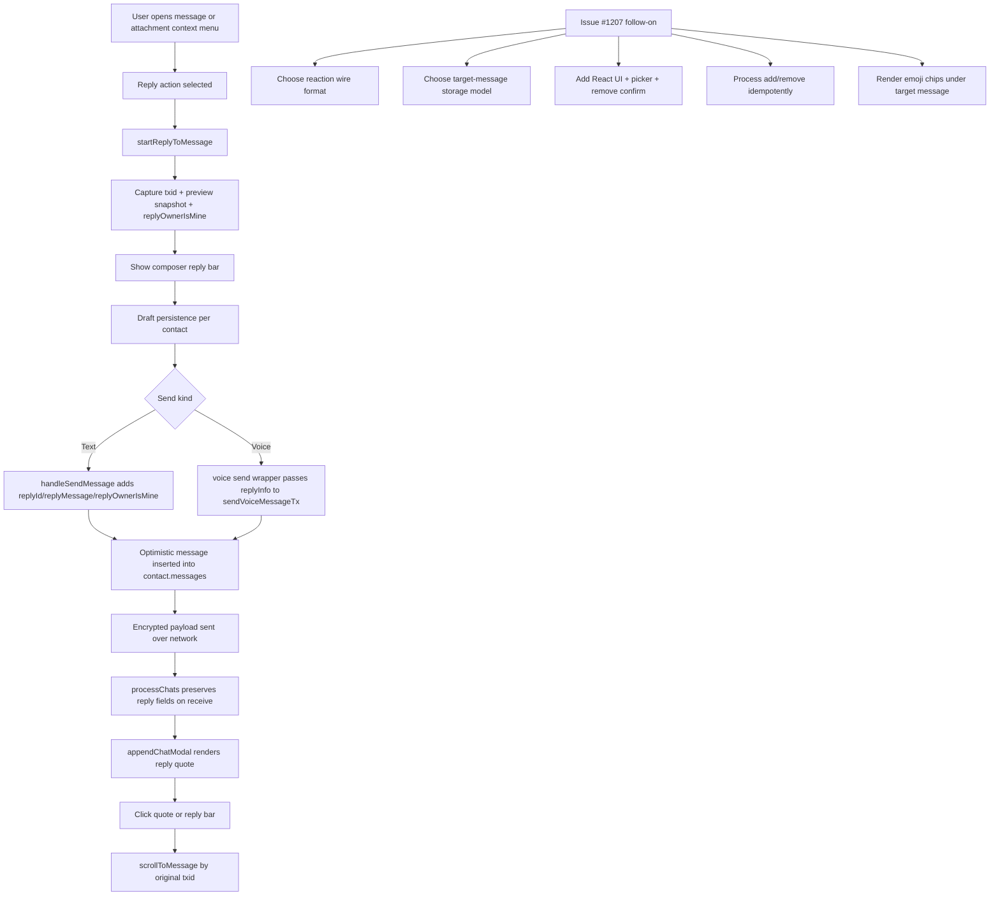

## Reply Message Feature Investigation

Issue context: GitHub issue `#1207` ("React with emoji to message") says reactions should be sent "similar to when a user is responding." This note documents how replies currently work so the reaction work can start from the real implementation instead of assumptions.

Repo note: there was not an existing reply-focused Markdown doc in this repo when this note was added.

## What The Current Reply Feature Is

The current reply feature is not a separate transaction type. It is metadata attached to a normal outgoing chat message.

- Text replies are sent as a normal `type: "message"` payload with extra reply fields.
- Voice replies are sent as a normal `type: "vm"` payload with the same extra reply fields.
- The composer keeps a single in-progress reply target.
- The rendered bubble shows a small quote block above the message body.
- Clicking the quote or the composer reply preview scrolls to the original message by `txid`.

## Main Code Map

- `index.html`
  - `#replyPreview` is the visible composer bar for an active reply.
  - `#replyToTxId`, `#replyToMessage`, and `#replyOwnerIsMine` are hidden inputs holding reply state.
  - `#messageContextMenu` and `#imageAttachmentContextMenu` both expose a `reply` action.
- `app.js`
  - `load()` wires reply DOM references and event listeners.
  - `startReplyToMessage()` starts reply mode from a message element.
  - `cancelReply()` clears composer reply state.
  - `getMessageTextForReply()` builds the preview/snapshot text.
  - `saveReplyState()` and `loadDraft()` persist reply drafts per contact.
  - `handleSendMessage()` includes reply metadata in text sends.
  - `sendVoiceMessageTx()` includes reply metadata in voice sends.
  - `processChats()` copies reply metadata from decrypted payloads into stored messages.
  - `appendChatModal()` renders the reply quote block.
  - `handleReplyPreviewClick()` and reply-quote click delegation call `scrollToMessage()`.

## UI Entry Points

Replies can currently be started from more than plain text messages.

- Standard message context menu:
  - Text messages
  - Voice messages
  - Call messages
  - Payment messages
- Attachment context menu:
  - Image and video attachment rows expose `Reply`

The context menu logic broadly keeps reply available unless the item is a deleted local-only stub. That means reply is treated as a general "reference this message" action, not a text-only feature.

## Composer State

The composer stores one active reply target in hidden inputs:

```text
replyToTxId
replyToMessage
replyOwnerIsMine
```

Those values are also mirrored into the current contact draft object when the user types, starts a reply, or cancels a reply:

```javascript
contact.draftReplyTxid
contact.draftReplyMessage
contact.draftReplyOwnerIsMine
```

That gives the current feature these properties:

- Reply state survives contact switches.
- Reply state survives draft reloads.
- The chat list preview can show `Replying to: ...` if there is no draft text yet.
- Only one reply target can be active at a time.

## How Reply Text Is Chosen

`startReplyToMessage()` does not store the whole original message object. It stores a short snapshot string built from the clicked DOM node.

`getMessageTextForReply()` currently derives preview text like this:

- Voice message: `Voice message` plus a time label if available
- Call message: `Call at ...` when the scheduled call time exists
- Payment without memo: amount and timestamp summary
- Payment with memo: memo text
- Plain message: `.message-content`
- Fallback: `messageEl.textContent`

The snapshot is then normalized and truncated to 40 characters before it is stored.

This means `replyMessage` is a compose-time preview, not a live lookup of the original message body.

## Outgoing Data Shape

Text replies are serialized inside the normal message object:

```json
{
  "type": "message",
  "message": "Sounds good",
  "replyId": "<original message txid>",
  "replyMessage": "<40-char preview snapshot>",
  "replyOwnerIsMine": false
}
```

Voice replies reuse the same reply fields:

```json
{
  "type": "vm",
  "url": "<voice message url>",
  "duration": 7,
  "replyId": "<original message txid>",
  "replyMessage": "<40-char preview snapshot>",
  "replyOwnerIsMine": true
}
```

### Meaning Of `replyOwnerIsMine`

This field is easy to misread. It is not "mine from the current viewer's perspective."

It means:

- From the sender's perspective, the original referenced message belonged to them.

Example:

- Alice replies to Bob's message.
- On Alice's device the original bubble is received, so `replyOwnerIsMine = false`.
- Bob receives Alice's reply with `item.my = false`.
- The renderer combines `item.my` and `replyOwnerIsMine` to infer that the referenced message owner is `You` from Bob's perspective.

This is why reply owner labeling works on both sides without needing the original message to exist locally.

## Send Flow

### Text Send

1. User selects `Reply` from a context menu.
2. `startReplyToMessage()` captures:
   - original `txid`
   - truncated preview text
   - `replyOwnerIsMine`
3. Composer shows the `Replying to:` bar.
4. `handleSendMessage()` builds the normal `messageObj`.
5. If `replyToTxId` is set, it adds:
   - `replyId`
   - `replyMessage`
   - `replyOwnerIsMine`
6. The optimistic message inserted into `contact.messages` gets the same reply fields.
7. Reply state is then cleared from the composer and draft state.

### Voice Send

1. Voice send wrapper reads the same hidden reply inputs before upload/send.
2. It passes a `replyInfo` object into `sendVoiceMessageTx()`.
3. `sendVoiceMessageTx()` writes the same reply fields into the outgoing `type: "vm"` object.
4. The optimistic voice message inserted into `contact.messages` also gets the same reply fields.
5. The wrapper clears composer reply state after send.

## Incoming Parse And Storage

Replies are not processed by a dedicated reply pipeline. Incoming chat parsing just preserves the extra fields when it sees them.

- If decrypted JSON is `type: "message"`, `processChats()` copies:
  - `replyId`
  - `replyMessage`
  - `replyOwnerIsMine`
- If decrypted JSON is `type: "vm"`, it does the same.
- The parsed payload is inserted into `contact.messages` as a normal message record.

So the stored message record is effectively:

```json
{
  "message": "Sounds good",
  "timestamp": 1710000000000,
  "sent_timestamp": 1710000000000,
  "my": false,
  "txid": "<reply txid>",
  "replyId": "<original txid>",
  /* "reactId" */
  "replyMessage": "Original preview",
  /* "reactMessage": would just be an emoji when processed add the emoji to the original message id (replyId) */
  "replyOwnerIsMine": false
  /* "reactAction": "set" */
}
```
## Render Behavior

The renderer prefers the stored owner hint from `replyOwnerIsMine`. If that hint is missing, it falls back to looking up the original message in `contact.messages` by `replyId`.

The rendered quote also stores:

```html
data-reply-txid="<original txid>"
```

That attribute powers click-to-scroll behavior.

## Navigation Behavior

There are two reply-linked navigation surfaces:

- Clicking the composer reply preview bar
- Clicking a rendered reply quote inside a message bubble

Both call `scrollToMessage(txid)`, which:

- finds the target bubble by `data-txid`
- scrolls it into the center area of the message list
- adds a temporary `highlighted` class
- shows `Message not found` if the original target is missing

## Important Constraints In The Current Design

These details matter because issue `#1207` says reactions should feel similar to replies, but the data needs are not identical.

- Reply is a one-to-one reference embedded in a new outgoing message.
- Reply UI assumes a single active target in the composer.
- Reply storage is a snapshot:
  - `replyMessage` is copied at compose time
  - it is not recomputed from the original later
- Reply metadata is copied manually in several places:
  - text send
  - voice send
  - optimistic inserts
  - draft save/restore
  - incoming parse
  - render
- Attachment-only reply previews can degrade to generic DOM text because preview extraction falls back to `messageEl.textContent`.
- Reply creates a new visible message bubble. Reactions probably should not create a normal message bubble in the same way.

## What This Suggests For Issue #1207

The issue body says reaction add/remove messages should be sent similarly to replies, but "similar" should probably mean "reuse the message-reference pattern," not "copy the reply implementation literally."

The biggest design question is where reaction state should live.

### Likely Better Than Copying Reply Directly

Replies:

- create a new message
- show a quote above that message
- keep only one referenced target per outgoing message

Reactions:

- mutate the display state of an existing target message
- only one active emoji per sender per target message; the newest emoji replaces the previous one
- need set/remove semantics
- need duplicate prevention and idempotent retry handling
- need remove confirmation

That makes reactions look closer to a control/action-message stream than to quoted-message rendering.

## Suggested Breakdown For Issue #1207

1. Decide the wire format.
   - Use the existing normal message object shape.
   - A message is treated as a reaction message when it carries:
     - `reactId`
     - `reactMessage`
     - `reactAction`
   - `reactId` is the target message `txid`.
   - `reactMessage` is the selected emoji.
   - `reactAction` should be either `set` or `remove`.
2. Decide the storage model.
   - Store reactions on the target message record after processing.
   - Store at most one active reaction per sender for each target message.
   - Define the main sender-level key as `reactId + sender`.
   - A repeated `set` for the same emoji from the same sender should be a no-op.
3. Add context-menu UI.
   - Add `React` alongside `Reply`.
   - Add emoji picker UI.
   - Decide which message kinds are reactable.
4. Add remove flow.
   - Clicking an existing reaction from the same sender should ask for confirmation before removal.
   - Removal should send a matching action message, not silently mutate local state only.
5. Add send and receive plumbing.
   - Serialize the outgoing reaction action.
   - Parse incoming reaction actions.
   - Apply add/remove updates idempotently.
6. Add rendering under the target bubble.
   - Render emoji chips connected to the message bubble.
   - Keep them visually separate from reply quotes and attachments.
7. Add edge-case handling.
   - Original target missing
   - Duplicate add
   - Remove without prior add
   - Deleted message target
   - Out-of-order arrival
8. Reduce copy-paste before or during implementation.
   - The reply feature currently duplicates "message reference metadata" logic in several places.
   - A shared helper for message-reference extraction/serialization may pay off before reactions land.

## Discussion Starters

- Should a reaction event remain visible as a normal message in history, or should it only materialize as state attached to the target message?
- Do we want reactions on all current reply-capable message kinds, or only plain chat messages first?
- Should reaction state be computed on demand from history, or denormalized onto each target message as events are processed?

## Phased Plan For Issue #1207

This section reflects the current discussion direction:

- Keep reactions inside the existing normal message object shape.
- A message is identified as a reaction message by the presence of:
  - `reactId`
  - `reactMessage`
  - `reactAction`
- `reactId` points at the original target message `txid`
- `reactMessage` is the selected emoji
- `reactAction` is `set` or `remove`
- when processed on receive, the sender has only one active reaction on the original message referenced by `reactId`

Phase checklist:

- [ ] Phase 1: Reaction Picker UI
- [ ] Phase 2: Send Reaction Event
- [ ] Phase 3: Receive And Process Reaction Event
- [ ] Phase 4: Render Reactions In `appendChatModal()`
- [ ] Phase 5: Highlight Current Emoji In Picker
- [ ] Phase 6: Remove Reaction
- [ ] Phase 7: Reaction Details Modal
- [ ] Phase 8: Full Emoji Picker Modal

### Proposed Stored/Event Shape

This is the rule to implement:

- same envelope style as other messages, but reaction events do not need a normal text `message` body
- reaction detection comes from the `react*` fields
- action selection comes from `reactAction`

Reply-shaped example with the reaction fields shown in the same analogous positions:

```json
{
  "message": "Sounds good",
  "timestamp": 1710000000000,
  "sent_timestamp": 1710000000000,
  "my": false,
  "txid": "<reply txid>",
  "replyId": "<original txid>",
  "reactId": "<original txid>",
  "replyMessage": "Original preview",
  "reactMessage": "👍",
  "replyOwnerIsMine": false,
  "reactAction": "set"
}
```

For an actual reaction message event, the minimal practical shape would be:

```json
{
  "timestamp": 1710000000000,
  "sent_timestamp": 1710000000000,
  "my": false,
  "txid": "<reaction event txid>",
  "reactId": "<original txid>",
  "reactMessage": "👍",
  "reactAction": "set"
}
```

The send-side JSON should stay inside the current message envelope:

```json
{
  "type": "message",
  "reactId": "<original txid>",
  "reactMessage": "👍",
  "reactAction": "set"
}
```

Implementation note:

- In generic parsing and payload-copy code, "where we check for `replyId`, also check for `reactId`" is a reasonable starting rule.
- In rendering and behavior code, reply and reaction should still branch separately.
- A reaction should not reuse the reply quote UI. It references a message, but it mutates the target bubble instead of rendering a new quoted bubble.
- We do not need `reactOwnerIsMine` on the wire. The sender of the reaction event already tells us who reacted.
- If rendering needs a convenience flag later, derive `myReaction` on the processed target-message reaction entry.

### Phase 1: Reaction Picker UI

Goal: when pressing a message, show the normal context menu plus a compact emoji row above it.

Targeting rule:

- When the context menu opens, the emoji picker references the same outer `.message` element that opened the menu.
- The reaction target id is the outer message element's `data-txid`.
- The picker does not target `.reply-quote`.
- The picker does not target `.message-content`.

```text
User presses outer message element
    |
    v
<div class="message ..." data-txid="<target txid>">
    [optional .reply-quote]
    [optional .message-content]
    [optional .message-time]
</div>
    |
    v
Open context menu + emoji picker
    |
    +--> currentContextMessage = outer .message element
    +--> reactId = currentContextMessage.dataset.txid
```

Scope:

- Add a reaction tray above the existing message context menu.
- Start with 4 to 5 fixed common emoji.
- Show the tray only when a message is reactable.
- Keep the existing `Reply` option in the menu.

Suggested first emoji set:

- `👍`
- `❤️`
- `😂`
- `😮`
- `👎`

Likely code touchpoints:

- `index.html`
  - add reaction tray container near `#messageContextMenu`
- `styles.css`
  - tray layout, spacing, active states, positioning above menu
- `app.js`
  - extend `showMessageContextMenu()`
  - extend image attachment context menu flow if attachments should also be reactable
  - store the current target message element for emoji selection
  - derive `reactId` from the current outer `.message[data-txid]`

Acceptance target:

- Clicking a message opens the usual menu.
- The emoji row appears above it.
- Clicking outside closes both tray and menu.
- No network behavior yet.

### Phase 2: Send Reaction Event

Goal: clicking an emoji sends a reaction event object tied to the selected target message.

Scope:

- Add a click handler for each emoji in the reaction tray.
- Build a normal message object carrying:
  - `reactId`
  - `reactAction`
- Derive `reactId` from the outer `.message[data-txid]` that the context menu is currently attached to.
- Reuse the same encryption and send path used for ordinary chat messages as much as possible.
- If the selected emoji is different from the current user's active emoji on that target, send `reactAction: "set"`.
- Apply the reaction change optimistically to the target message state so the chip can appear immediately.
- If the reaction send fails, revert the optimistic change on the target message.
- Show an error toast when the reaction send fails so the user knows the emoji reaction did not send.
- Duplicate incoming or retried `set` events for the same sender/target/emoji should be treated as no-ops.

Reaction event data structure for this phase:

- The send-side inner message object should not include local processed fields such as:
  - `my`
  - `timestamp`
  - `sent_timestamp`
  - `txid`
- The send-side inner message object should only include the semantic reaction fields needed over the wire.
- `reactMessage` is required for `set`.
- `reactMessage` is not required for `remove`.

Send-side inner message object for setting a reaction:

```json
{
  "type": "message",
  "reactId": "<original txid>",
  "reactMessage": "👍",
  "reactAction": "set"
}
```

Send-side inner message object for removing a reaction later:

```json
{
  "type": "message",
  "reactId": "<original txid>",
  "reactAction": "remove"
}
```

After processing, the stored reaction event record can look like:

```json
{
  "timestamp": 1710000000000,
  "sent_timestamp": 1710000000000,
  "my": false,
  "txid": "<reaction event txid>",
  "reactId": "<original txid>",
  "reactMessage": "👍",
  "reactAction": "set"
}
```

That means phase 2 is responsible for creating only the send-side object, while later processing phases are responsible for adding local fields and attaching the reaction state to the target message.

Rule for this phase:

- A reaction is not identified by a new `type`.
- A reaction is identified by the presence of `reactId`.
- `reactAction: "set"` means create or replace this sender's active reaction on the target.
- `reactAction: "remove"` means clear this sender's active reaction on the target.
- Do not reuse `replyMessage`; keep `reactMessage` separate so the receiver can treat it differently.
- `reactMessage` should be present for `set` and omitted for `remove`.
- Reaction events should not send a normal text `message` body.
- Reaction failure handling should behave more like edit failure than normal-message failure:
  - optimistically mutate the target message state
  - revert that mutation if send fails
  - show an error toast

Likely code touchpoints:

- context-menu action handling in `app.js`
- send builder around `handleSendMessage()` or a new helper dedicated to reaction sends
- optimistic apply/revert helper for target-message reaction state

Acceptance target:

- Clicking `👍` on a message emits a properly encrypted outgoing message event.
- The event contains the original target `txid`.
- Clicking a different emoji replaces the current user's existing reaction for that target.
- Reprocessing the same `set` event does not create extra state.
- If send fails, the optimistic chip change is reverted.
- If send fails, the user sees an error toast indicating the reaction did not send.

### Phase 3: Receive And Process Reaction Event

Goal: when a reaction event is received, attach the emoji to the original target message.

Scope:

- During incoming parse, preserve:
  - `reactId`
  - `reactMessage`
  - `reactAction`
- Resolve the target message by `reactId`.
- Add reaction state onto the target message record.
- Keep the update idempotent.

Recommended processed target shape:

```json
{
  "txid": "<original txid>",
  "message": "Sounds good",
  "reactions": [
    {
      "emoji": "👍",
      "from": "<sender address or identity key>",
      "myReaction": false
    }
  ]
}
```

Why this helps:

- `appendChatModal()` can render reactions directly from the target message.
- each sender can have one stable reaction entry on the target message
- `myReaction` gives later phases a direct flag for ownership logic without requiring ownership-specific chip styling right away
- duplicate prevention becomes a stable lookup against sender + target
- remove flow later has a clean place to mutate

Important note:

- This is the point where "check `replyId` or `reactId`" stops being sufficient by itself.
- Reply events stay attached to the event bubble.
- Reaction events should update the referenced target bubble.
- The referenced target bubble means the outer `.message[data-txid]` element for the original message.

Likely code touchpoints:

- `processChats()` parse and payload-copy logic
- post-parse message normalization
- local message model update for the target message

Acceptance target:

- Receiving a reaction event updates the original message state.
- A new `set` from the same sender replaces the old emoji instead of accumulating.
- Reprocessing the same `set` does not duplicate the emoji.
- Missing targets fail safely.

### Phase 4: Render Reactions In `appendChatModal()`

Goal: show reaction chips below the original message and visually connected to it.

Scope:

- Extend the message renderer to look for `item.reactions`.
- Render emoji chips on the target message's outer `.message` wrapper, below the main bubble content.
- Render the chip container as a sibling of `.reply-quote`, `.message-content`, and `.message-time`.
- Do not render reaction chips inside `.reply-quote`.
- Do not render reaction chips inside `.message-content`.
- Keep reactions visually distinct from reply quotes.
- Support multiple chips on one message only when they come from different senders.
- Do not visually distinguish whether a chip came from the current user or the contact in this phase.

Likely code touchpoints:

- `appendChatModal()` in `app.js`
- `styles.css` for chip layout and message attachment styling

Acceptance target:

- Messages with reaction state render emoji below the bubble.
- The reaction chip container is attached to the outer `.message[data-txid]` element for the target message.
- Each sender contributes at most one visible reaction chip per message.
- Multiple reactions are shown in a stable order when multiple senders reacted.
- The rendered chip UI does not reveal whether the reaction came from the current user or the contact.
- Reply quotes and reaction chips can coexist on the same message.

### Phase 5: Highlight Current Emoji In Picker

Goal: when reopening the reaction tray for a message, show which emoji is currently the user's active reaction on that target.

Scope:

- When the reaction tray opens, inspect the target message's processed reaction state.
- If the current user already has a reaction on that target, highlight the matching emoji in the tray.
- Use a simple active treatment such as a circle, underline, or similar subtle visual marker.
- Keep this highlight behavior separate from initial tray rendering so phase 1 can stay UI-only.

Likely code touchpoints:

- `app.js`
  - lookup of current user's reaction on the target message
  - tray state initialization when the context menu opens
- `styles.css`
  - active emoji styling in the quick reaction tray

Acceptance target:

- Reopening the reaction tray for a message with an existing user reaction marks the matching emoji as active.
- Messages without a current user reaction show no active quick-reaction state.
- The highlight is derived from processed reaction state, not from ad hoc DOM memory.

### Phase 6: Remove Reaction

Goal: the sender can click their existing emoji reaction and remove it after confirmation.

Scope:

- Detect when the user presses the highlighted emoji for the current target.
- Ask for confirmation.
- Send a removal event using the same target id and `reactAction: "remove"`.
- Update the original message state on receive and on optimistic local apply.

Suggested remove event shape:

```json
{
  "type": "message",
  "reactId": "<original txid>",
  "reactAction": "remove"
}
```

This implies add events should probably carry:

```json
"reactAction": "set"
```

Acceptance target:

- Pressing the currently highlighted emoji asks for confirmation.
- Confirming sends a remove event.
- The emoji disappears from the target message once processed.

### Phase 7: Reaction Details Modal

Goal: when the user presses a rendered reaction chip, open a modal showing which participant the reaction came from.

Scope:

- Add a reaction-details modal opened by pressing a rendered reaction chip.
- Show the selected emoji centered in the modal header.
- Show the participant identity below using profile imagery and display name.
- For now, the modal only needs to support the current chat participants:
  - current user
  - current contact
- Use processed ownership data such as `myReaction` to decide whether the modal shows the current user or the contact.

Likely code touchpoints:

- `app.js`
  - click handling for rendered reaction chips
  - modal open/close logic
  - mapping `myReaction` to current user vs contact details
- `index.html`
  - modal container and header/body structure
- `styles.css`
  - centered emoji header styling
  - profile row layout and spacing

Acceptance target:

- Pressing a rendered reaction chip opens a modal.
- The emoji is centered in the modal header.
- The modal shows who the reaction came from using the user/contact profile image and name.
- The chip itself still does not need ownership-specific styling in the chat bubble.

### Phase 8: Full Emoji Picker Modal

Goal: add a greyed-out emoji chip with a plus sign that opens a full emoji picker modal.

Scope:

- Add an extra reaction affordance that looks visually muted compared with the normal rendered chips.
- The affordance should read like:
  - greyed-out emoji
  - plus sign
- Pressing that affordance should open a full emoji picker modal.
- The modal should expose a broad emoji set intended to stay compatible with emoji commonly supported on both Google and Apple platforms.
- This phase extends the quick fixed-emoji reaction flow rather than replacing it.

Likely code touchpoints:

- `appendChatModal()` in `app.js`
  - render the extra greyed-out add-reaction affordance on the outer `.message` wrapper
  - wire chip press handling to the full emoji picker modal
- `index.html`
  - emoji picker modal container and structure
- `styles.css`
  - muted add-reaction chip styling
  - plus-sign treatment
  - full emoji picker modal layout
- `app.js`
  - modal open/close logic
  - emoji selection handling
  - handoff from picker selection into the existing reaction send flow

Acceptance target:

- A greyed-out emoji chip with a plus sign is visible as an add-reaction affordance.
- Pressing it opens a full emoji picker modal.
- The modal supports a broad emoji set intended for common Google/Apple compatibility.
- Selecting an emoji from the modal can flow into the existing reaction selection/send behavior.

## Practical Refactor Rule

For implementation, a useful first-pass grep rule is:

- anywhere reply metadata is copied or parsed, inspect whether reaction metadata needs the same treatment

Concretely that means looking for:

- `replyId`
- `replyMessage`
- `replyOwnerIsMine`

and deciding whether to add matching handling for:

- `reactId`
- `reactMessage`
- `reactAction`

But the branching should remain explicit:

- reply logic: quote renderer, reply preview, reply scroll behavior
- reaction logic: emoji picker, target-message update, reaction-chip renderer, add/remove rules


