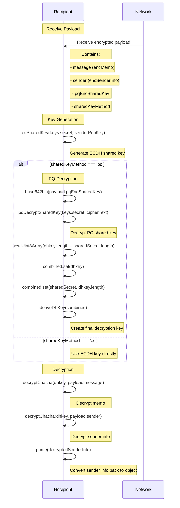

# Decryption Sequence Diagram
This diagram shows the process of decrypting a message that was encrypted using the hybrid ECDH + Post-Quantum encryption scheme. It illustrates how the recipient:
1. Receives the encrypted payload
2. Generates their ECDH shared key
3. Decrypts the PQ shared key (if PQ was used)
4. Combines the keys to create the final decryption key
5. Decrypts both the message and sender information

