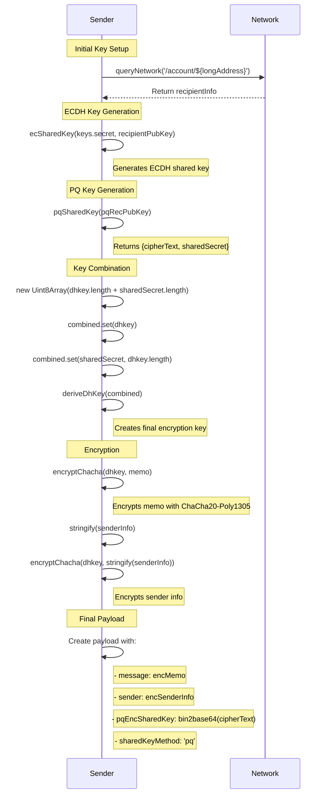

# Encryption Sequence Diagram
This diagram illustrates the step-by-step process of encrypting a message using both ECDH (Elliptic Curve Diffie-Hellman) and Post-Quantum (PQ) cryptography. It shows how the sender:
1. Retrieves recipient information
2. Generates ECDH shared key
3. Generates PQ shared key
4. Combines both keys
5. Encrypts the message and sender info
6. Creates the final encrypted payload

