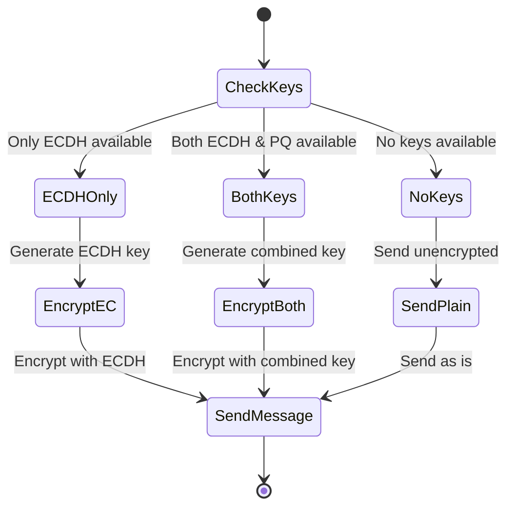

# Encryption States Diagram
This diagram shows the different states and paths that can occur during the encryption process, depending on what cryptographic keys are available:
1. If only ECDH keys are available, it uses ECDH-only encryption
2. If both ECDH and Post-Quantum (PQ) keys are available, it uses hybrid encryption
3. If no keys are available, it falls back to sending unencrypted messages
This ensures backward compatibility while providing the strongest possible encryption when available.

