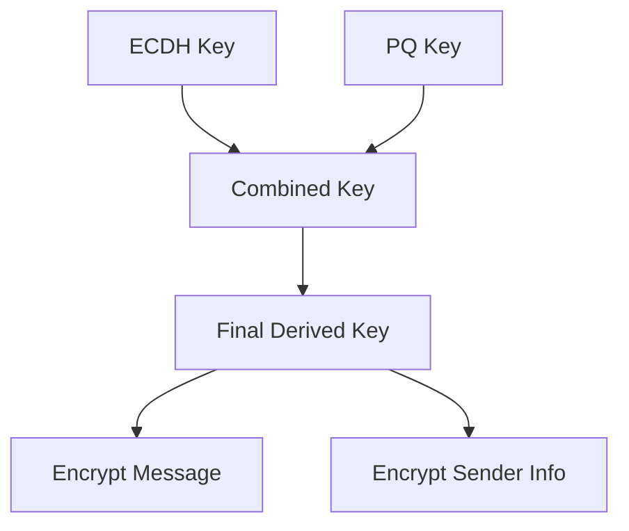

# Key Combination Flow Diagram
This diagram shows the simple flow of how the final encryption key is created by combining:
1. The ECDH (Elliptic Curve Diffie-Hellman) key
2. The Post-Quantum (PQ) key
These are combined and then derived into a final key that is used to encrypt both the message and sender information.

